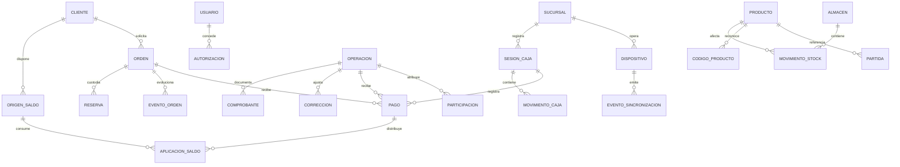

# Modelo lógico y contratos propuestos

E0 v1.0 · Diseño para revisión, no esquema ejecutado. D17-D20 determinan detalles técnicos en E1. Se propone separar hechos originales, eventos de corrección y vistas de consulta. La fuente funcional permanece el PDF v2.

## Relaciones principales



Diagrama conceptual: `OPERACION` es la cabecera común y `ORDEN` su especialización para apartados/reparaciones. No se duplican pagos por ambas relaciones: cada pago tiene un único documento económico de destino y una caja de registro; las claves/constraints finales deben comprobarlo. Una corrección puede apuntar también a pago/partida/sesión mediante vínculos explícitos.

## Entidades y campos esenciales

| Grupo | Entidad propuesta | Campos / restricciones principales |
| --- | --- | --- |
| Organización | sucursal, almacén, dispositivo | UUID estable, código, estado; dispositivo pertenece a sucursal; venta de ambos locales afecta almacén Coyoacán, no una cuota del dispositivo |
| Acceso | usuario, derecho, asignación, autorización | Usuario activo; derecho y límite; operación autorizada, operador, autorizador y fecha. Vendedor puede coincidir con usuario sin confundir identidades |
| Catálogo | material, tipo, subcategorías, proveedor, producto | Claves estables, activación; proveedor/costo/descripciones obligatorios, peso opcional ≤999.000; precio manual; una imagen opcional; profundidad controlada |
| Códigos | código_producto | Texto único, producto, vigente/alias, fechas y motivo; no reasignar a otro producto; secuencia de generación atómica según D10 |
| Precio/costo | historial_valor | Valor anterior/nuevo, usuario, motivo si procede, fecha; cada partida conserva su snapshot; catálogo no reescribe ventas |
| Inventario | movimiento_stock | Producto, almacén, estado, delta, evento origen, fecha operación/recepción, actor/autorizador, motivo, ingreso/lote si D12; índice de unicidad por efecto |
| Reservas | reserva | Orden, producto, cantidad, almacén/estado y custodia; vínculo persiste al traspasar unidades reservadas; reparación no es mercancía propia |
| Ingresos | ingreso, ingreso_partida, importación | Folio, almacén, cantidades, origen archivo, identidad de contenido, confirmación y reversión; importación confirmada una sola vez |
| Caja | sesión_caja, movimiento_caja, cierre | Sucursal y dispositivo origen, responsables/fechas, fondo, contado, esperado original, diferencia, fondo siguiente, sobre; cierres originales inmutables |
| Comercial | operación, partida, participación | Tipo, sucursal operación/reconocimiento, fechas, cliente opcional, caja, importe; cantidades y snapshots; vendedores con fracción e importe atribuido |
| Cobro | pago, pago_medio | Destino único, caja/sucursal, fecha, monto aplicado; efectivo recibido/cambio separados; tarjeta banco/tipo/últimos4, transferencia referencia; saldo vinculado por origen |
| Apartado | apartado y eventos | Alta/plazo asignado, vendedor inicial, total/costo alta, liquidación, entrega/liberación/cancelación, reserva; sin descuento ni sustitución pendiente |
| Reparación | reparación, piezas_cliente, presupuesto_version | Datos trabajo/piezas, presupuesto original/ajustado y acuerdo, pago, estado, historial de inicio, fecha lista/plazo, entrega; no ingreso a inventario comercial |
| Cliente | cliente, identidad_alias, credencial_cliente | Nombre/teléfono/observación, configuración futura; bloqueo/cuenta de fallos central; credencial protegida y separada de historial de comprobante |
| Saldo | origen_saldo, aplicación, restitución/anulación | Importe/origen/vigencia congelados, cliente y disponible derivado; devolución al mismo origen, no prórroga; consumo atómico |
| Ajuste | cambio, vínculo_unidad, corrección | Origen, unidades ya retornadas, partidas nuevas, diferencia; motivo, antes/después, actor/autorizador, fecha efectiva y fecha registro; original preservado |
| Documento | comprobante, versión_presentación, impresión | Datos históricos propios; destinatario, folio, vínculo; trabajos de impresión separados de venta/pago; emisión de código usa canal protegido aparte |
| Reportes | cálculo_comisión, alerta, revisión_alerta | Captura de filtros/porcentaje/importe; revisión/resolución distintas; recurrencia como evento nuevo |
| Integración | evento_sync, acuse, incidencia, correspondencia_legacy | UUID, dispositivo, secuencia, versión esquema, fechas, payload y huella; estatus local; origen histórico con precisión/calidad explícitas |

## Invariantes a implementar

1. Dinero exacto (centavos o decimal), moneda MXN. Evitar flotantes binarios para reglas económicas. D01 define reparto/redondeo y si se permiten ventas de total cero.
2. Una sesión **operativa** por sucursal, sin confundir sesiones históricas cuyo cierre aún no llegó. D19 define coordinación y recuperación; un índice sobre cualquier fila sin cierre no basta por sí solo.
3. Sin stock de sucursal: saldo central por producto/almacén/estado = suma de efectos confirmados. En desconexión, último disponible conocido menos salidas locales aún no reflejadas. El acuse no descuenta otra vez.
4. Una venta admitida online verifica/consume disponible con concurrencia controlada; la recepción de una venta ya cobrada offline conserva el hecho aunque revele negativo. Son comandos diferentes.
5. Entrada/salida de traspaso y vínculos de reserva se confirman en conjunto. Mover estado es delta negativo de origen y positivo de destino; no cambia cantidad total sin una causa de baja/ingreso.
6. Orden separa trabajo/custodia/pago. Reconocer venta al liquidar apartado no implica entrega física. Propuesta: mantener reserva no disponible hasta entregar; la representación contable/física exacta de custodia se valida antes de E5.
7. Entrega de orden completa, online, POS, liquidada; reparación también lista para entregar. No elegir solo algunas piezas.
8. Pago registra hecho recibido y destino; aplicar saldo es un medio sin dinero nuevo. Caja, venta y atribución usan proyecciones distintas.
9. Corrección es evento, nunca UPDATE destructivo del original. COR-17 se valida por estado liquidado, aun si un pago hubiera sido erróneo.
10. Presupuesto ajustado + exceso a saldo + cambio de estado económico se confirman juntos según D05. Cancelación comercial puede crear una venta vinculada, no dinero/saldo libre por defecto.
11. Contador de fallos y consumo de saldo son globales/atómicos entre ambos locales. Unificación conserva origen/vencimiento/bloqueo y cancela credenciales antiguas.
12. Importar histórico no invoca el comando de venta operativa ni afecta apertura/cobros/stock actuales. Correspondencias únicas y controles de repetición por lote/registro fuente.
13. Desactivación de producto/persona conserva referencias. Identificadores públicos no se reutilizan; costos históricos faltantes no se completan con actuales.

## Transacciones que deben ser indivisibles

| Comando | Hechos que deben confirmarse juntos |
| --- | --- |
| Venta | Cabecera/partidas, pago/medios, participación, salida stock, referencia caja, acuse |
| Apartado nuevo | Cliente/vínculo, reserva, precio/costo alta, participantes y anticipo/medios |
| Abono/liquidación | Pago, aplicaciones de saldo si hay, deuda y evento único de reconocimiento si se liquida |
| Cambio | Validación de unidades origen, entrada/salida, valor reconocido, cobro diferencia y atribución |
| Corrección | Evento/antes-después, efectos compensatorios y vínculos; marca revisión de comisiones |
| Saldo | Consumo de cada origen, disponibilidad protegida y medio de pago destino |
| Traspaso | Ambos deltas, estado/reserva y comprobante |
| Importación | Todas las filas y catálogo/ingreso, o ninguna; reintento devuelve resultado anterior |

Impresión sucede después de guardar. Fallar el papel no revierte un cobro; un comprobante no crea dinero por imprimirse otra vez.

## Contrato conceptual de sincronización (propuesta E1)

```json
{
  "schema_version": 1,
  "operation_id": "uuid-estable-de-ejemplo",
  "device_id": "dispositivo-de-ejemplo",
  "sequence": 42,
  "kind": "sale_recorded",
  "occurred_at": "2026-09-23T10:15:00-06:00",
  "business_timezone": "America/Mexico_City",
  "session_id": "sesion-de-ejemplo",
  "actor_id": "operador-de-ejemplo",
  "authorization_id": null,
  "policy_version": "version-local-de-ejemplo",
  "depends_on": ["uuid-apertura-de-ejemplo"],
  "payload": {"total_cents": 100000, "cash_applied_cents": 40000, "card_cents": 60000}
}
```

Ejemplo abreviado, no payload ejecutable de la función SQL actual. El evento completo incluye partidas, medios y vendedores. Dispositivo/sucursal se verifican con identidad autenticada; no confiar en valores libres enviados por el navegador. Deben preservarse el mismo UUID y contenido al reintentar.

Respuesta propuesta: `accepted`, `already_received`, `accepted_with_issue`, `waiting_dependency` o `needs_review`. Los dos últimos conservan el evento local y su motivo; no implican volver a cobrar. Mismo UUID con payload distinto es conflicto, nunca sobrescritura silenciosa. El acuse incluye identificador, recepción y estado; su persistencia local marca lo ya reflejado.

Secuencia local monotónica, dependencias explícitas apertura→movimientos→cierre→nueva apertura. Recibir fuera de orden puede esperar dependencias y reintentar; no usar hora de recepción como hora de venta. Desactivación de usuario/dispositivo no debe perder ventas previas: revisar aceptación de hechos versus autorización de operaciones nuevas según D18-D19.

Estados impresión/copia/sincronización separados; copia local externa no es evento comercial. La segunda copia nunca depende exclusivamente de que otro POS esté encendido. D20 fija garantías y límites frente a disco perdido.

## Modelo de migración

Preparación → validación → correspondencias → existencias iniciales + órdenes activas + histórico (canales separados) → comparación → acta de aceptación. Cada fuente tiene ID original, lote, precisión de fecha/hora, sucursal/costo conocidos o desconocidos y reglas de inclusión. Conservar referencias a artículos sin stock y documentos antiguos necesarios. No ejecutar carga final hasta E8.
