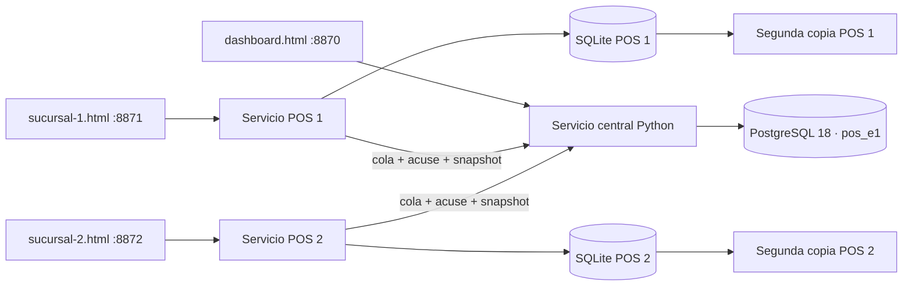

# Arquitectura y decisiones · 25/09/2026

## Acuerdos del usuario

- E0 revisada y aceptada en sus recorridos de venta, caja y órdenes. Esto no acepta por omisión todas las decisiones D01-D24 del plan.
- Tres HTML locales: dashboard, POS Sucursal 1 y POS Sucursal 2; inventario común de Coyoacán.
- PostgreSQL central y ejecución en Linux, por instrucción expresa durante el desarrollo.
- Carlo administrador; Melissa, Ximena, Citlali, Jessica, Himelda y Zicaru limitadas inicialmente. Panel para editar propiedades, contraseña y rol; roles administrables.
- Descuentos solo porcentuales, con límite configurable por administrador.
- Offline: última autorización descargada, sin introducir una caducidad nueva no acordada. Se exige primera autenticación online en cada POS.
- Configuración de ticket y generación PDF como sustituto de impresión de prueba.
- Alta manual de productos e ingresos ahora; Excel después. Correcciones de operaciones adelantadas dentro del laboratorio.
- Logotipo adjunto y manual de identidad como referencia de diseño.

## Componentes

En el ensayo los servicios HTTP viven en el mismo proceso y máquina, con puertos, sesiones de navegador, bases y colas separados. El interruptor de desconexión bloquea las peticiones de ese servicio POS a la central; la página sigue hablando con su servicio local. Desconectar por completo el navegador de su localhost no es la simulación correcta.

`server.py` expone únicamente archivos estáticos permitidos y endpoints autenticados. PostgreSQL usa rol de aplicación sin superusuario. El navegador no recibe DSN, claves de servicio, verificadores de contraseña ni firma de autorización. Los servicios internos se autentican entre sí con clave aleatoria en memoria. Configuración y datos privados quedan fuera del directorio servido.

PostgreSQL contiene productos, existencias, eventos, correcciones, libro de stock, ingresos, relaciones de cambios y auditoría. En esta fase usuarios/roles/plantillas y parámetros se agrupan en registros JSON de la tabla `kv`; las próximas migraciones pueden normalizarlos sin cambiar los contratos. El esquema efectivo queda en `lab/e1/schema-postgresql.sql`; el código de inicialización es idempotente. No se aplicaron cambios al esquema histórico `pos` del laboratorio v0.1.

## Consistencia

- SQLite WAL, sincronización FULL, transacciones y cola independiente por POS.
- UUID persistente por petición; si se pierde la respuesta, reintentar conserva el identificador. Diferente contenido con mismo ID se rechaza.
- Secuencia por sucursal (un servicio local operativo por sucursal en este ensayo); cierres y aperturas siguen orden.
- Central confirma stock/evento/acuse en una transacción PostgreSQL con exclusión transaccional. El esquema compartido no reparte cupos.
- Acuses y snapshot local se guardan juntos. Si se pierde la respuesta del snapshot, permanecen pendientes y se reenvían sin descontar dos veces.
- Venta conectada con stock central insuficiente se rechaza. Venta ya guardada desconectada se conserva aun cuando deje stock negativo, con incidencia.
- Correcciones e ingresos tienen IDs propios, confirmación, auditoría y transacción. Los triggers impiden UPDATE/DELETE ordinarios sobre hechos de ventas, correcciones y movimientos. No se afirma protección frente al dueño de la base.
- Correcciones generan diferencias sobre caja histórica, nunca modifican el cierre original ni inyectan efectivo físico en la caja de hoy. Reemplazos generan ventas vinculadas consultables y corregibles; el acumulado considera la vista ajustada.

## Decisiones técnicas del laboratorio

Importes en centavos enteros. Porcentaje hasta dos decimales, representado en centésimas de porcentaje. Descuento total redondeado al centavo más cercano, mitades hacia arriba; reparto proporcional por mayor residuo, empate por orden de partida. Atribución por vendedores en partes iguales; centavo residual a IDs ordenados. Estas son reglas de laboratorio documentadas, pendientes de ratificar con los casos contables completos de E3/E6/E7. El total cero sigue bloqueado.

Código nuevo: MM + TT + PPPPPP + NNNNN. Peso ausente se conserva como nulo, aunque el segmento del código sea 000000. Consecutivo por material/tipo, sin reutilizar códigos. Catálogos iniciales de material/tipo y proveedor de prueba; no se importaron datos reales.

Los reemplazos corrigen el registro y se vinculan a la fecha económica original, conservando su propia fecha de registro/corrección. No se accede a banco ni se transfiere automáticamente un pago. Si el importe correcto difiere, el operador captura cómo quedó realmente repartido el pago; el laboratorio no resuelve una entrega/cobro físico adicional al cliente. Ese caso comercial requiere regla específica antes de operación.

## Respaldo y recuperación

Copias de cada SQLite en `lab/e1/data/second-copy`; fallar esa copia muestra aviso y no impide guardar en el POS. No depende del otro POS. pg_dump en `lab/e1/data/backups`, con prueba de pg_restore en otra base. No hay copia fuera del equipo, retención programada ni garantía ante pérdida del disco. Tras restaurar una copia vieja de POS que no contenga operaciones ya enviadas se requiere reconciliar secuencia/identidad antes de seguir: el receptor bloquea discrepancias en vez de sobrescribirlas.

Fuentes técnicas consultadas: [PostgreSQL 18](https://www.postgresql.org/docs/18/tutorial-start.html), [instalación de Psycopg](https://www.psycopg.org/psycopg3/docs/basic/install.html). La validación decisiva de esta entrega es la ejecución local descrita en el reporte.
