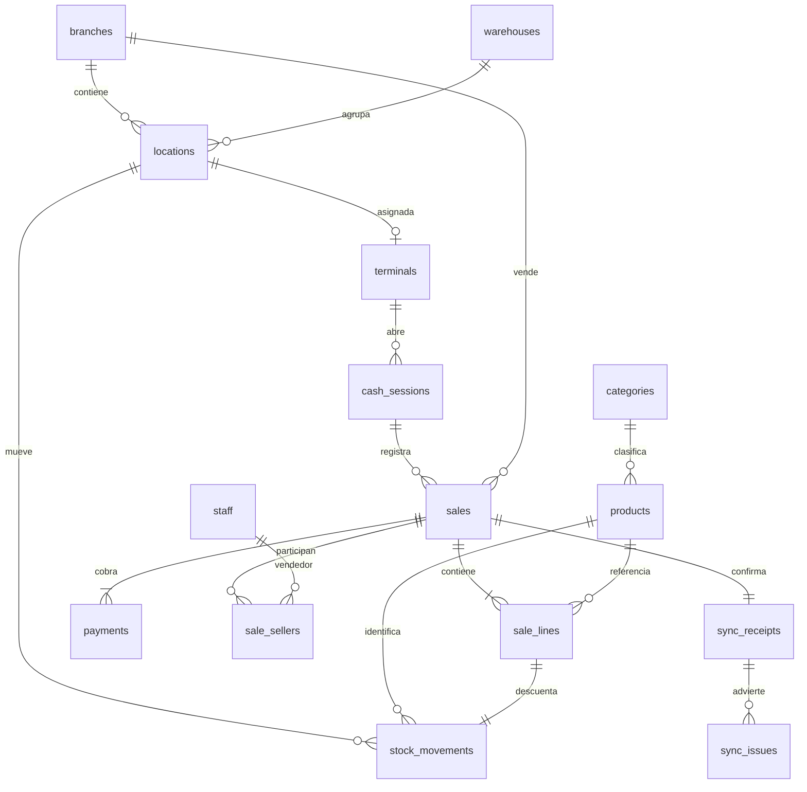

# Modelo v0.1



Relaciones comerciales del flujo de recepción; algunas cardinalidades se garantizan por la función de escritura, no únicamente por claves foráneas. No representa oficinas como sucursales de venta. `legacy_mappings` y `schema_migrations` son auxiliares.

## Contrato inicial: recibir una venta ya cobrada

`pos.receive_sale(operation_id UUID, terminal_id UUID, payload JSONB) -> sale_id UUID`

Los UUID de operación y venta y el consecutivo local se generan y persisten antes de enviar. En cada reintento se conserva el mismo contenido. El consecutivo es por terminal, no se reinicia cada día. Si se reinstala una terminal y se pierde su contador, hay que recuperar su identidad/estado o asignar una identidad nueva; no reiniciar a 1 con la identidad anterior.

Ejemplo ilustrativo; sustituir referencias por identificadores existentes:

```json
{
  "sale_id": "30000000-0000-4000-8000-000000000001",
  "cash_session_id": "40000000-0000-4000-8000-000000000001",
  "cashier_id": "50000000-0000-4000-8000-000000000001",
  "local_sequence": 1,
  "occurred_at": "2026-09-14T09:43:21-06:00",
  "captured_offline": true,
  "discount": "0.25",
  "lines": [{
    "product_id": "60000000-0000-4000-8000-000000000001",
    "barcode": "0000123",
    "description": "Anillo",
    "quantity": 1,
    "unit_price": "100.25",
    "unit_cost": "70.00",
    "weight_grams": "2.350"
  }],
  "payments": [{
    "id": "70000000-0000-4000-8000-000000000001",
    "method": "cash",
    "amount": "100.00"
  }],
  "sellers": ["50000000-0000-4000-8000-000000000001"]
}
```

El total se calcula en el servidor y los pagos deben sumar exactamente ese total. El efectivo representa el importe aplicado, descontando el cambio; falta definir captura separada de efectivo entregado/cambio en el módulo de caja. Los pesos y costos son instantáneas opcionales, no una consulta futura al catálogo.

La función requiere que productos, personal y sesión de caja existan previamente. La futura API deberá ordenar y confirmar esas dependencias, autenticar la terminal y aplicar permisos. No exponer esta función directamente a navegadores.

Una incidencia de stock conserva la venta; no se devuelve un error que induzca a cobrar otra vez. El módulo de sincronización deberá leer y presentar `sync_issues`. Un error de validación revierte toda la importación: la operación debe permanecer en la cola local para revisión/reintento, sin perder el cobro original.

Una fecha futura de más de cinco minutos produce aviso de reloj. No sustituye sincronización de reloj ni establece confianza absoluta en la hora del dispositivo.

## Orden de trabajo restante

1. Aprobar catálogo, generación de códigos y recepción/conteos/traspasos de mercancía.
2. Implementar escritura de inventario y protocolo de asignación con pruebas de desconexión y recuperación.
3. Añadir autenticación, autorización, permisos, política de descuentos y caja completa.
4. Construir almacenamiento local duradero y API de sincronización.
5. Especificar apartados y reparaciones antes de extender sus tablas y pagos.
6. Mapear datos antiguos e importar primero a un área de preparación; conciliar antes de incorporar datos a las tablas operativas.
